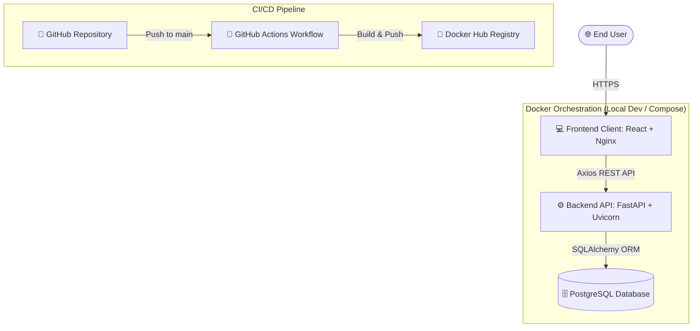
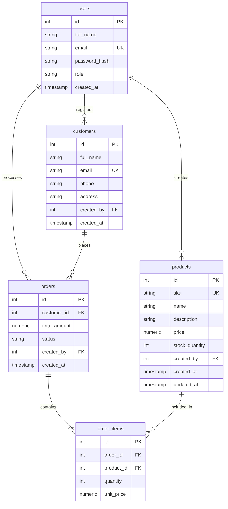
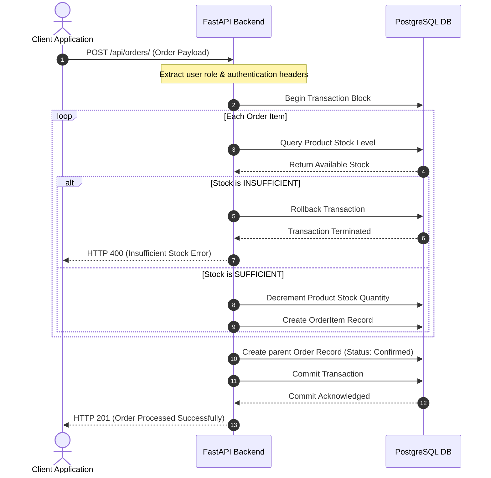

# 📦 Stockflow | Smart Inventory & Order Management System

[](./build-and-push.ps1)
[](./.github/workflows/docker-publish.yml)
[](https://fastapi.tiangolo.com/)
[](https://react.dev/)
[](https://www.postgresql.org/)

**Stockflow** is a modern, production-ready, full-stack SaaS platform designed for tracking products, managing customer records, processing orders, and visualizing sales metrics in real-time.

It features a high-fidelity responsive user interface, atomic database transactions with automatic rollback safety, and complete containerization for local development and cloud deployment.

---

## 🏗️ System Design Architecture

The following diagram illustrates the deployment topology and runtime architecture of Stockflow. The application is completely containerized and communicates securely via REST APIs.



---

## 📋 Database Schema (Entity Relationship Diagram)

Stockflow uses a PostgreSQL database schema containing structural integrity constraints (cascade deletes, resticts, indexings, and composite key concepts) optimized for high transaction loads.



---

## 🔄 Business Transaction Workflow (Order Checkout)

The diagram below highlights the sequential flow of transactional safety and automatic rollbacks during the order placement cycle.



---

## ✨ Features & Capabilities

- **📊 Dashboard Visualization**:
  - Live charts illustrating monthly sales and order volumes via Recharts.
  - Aggregated system metrics (total items, customer reach, pending fulfillments).
- **🛍️ Inventory Management**:
  - Full CRUD operations on products.
  - Automatic constraint protection: cannot delete a product that exists in a placed order.
  - Multi-condition indexing on Product SKU to guarantee quick searches.
- **👥 Customer Tracking**:
  - Clean profiles linking orders, unique email registry safeguards, and phone records.
- **📋 Order Pipeline & Transaction Engine**:
  - Real-time stock reservation upon checkout.
  - Status updates: transition order states between `Pending`, `Confirmed`, and `Cancelled`.
  - Cancelled orders trigger auto-recovery of stock (replenishes catalog items).

---

## 🛠️ Technology Stack

| Component | Technology | Key Libraries / Frameworks |
| :--- | :--- | :--- |
| **Frontend** | React 19 & Vite | Material-UI v6 (Theme configuration), React Hook Form, Recharts, Axios |
| **Backend** | Python 3.11 | FastAPI, SQLAlchemy ORM, Pydantic v2, Alembic Migrations, Pytest |
| **Database** | PostgreSQL 16 | Relational schema with index hooks and deletion restrictions |
| **DevOps** | Docker | Docker Compose, GitHub Actions, multi-stage Nginx configurations |

---

## 🚀 Quick Start Setup

### Prerequisites
- [Docker Desktop](https://www.docker.com/products/docker-desktop/)
- Git (configured)

### 1. Booting with Docker Compose
The easiest way to launch the entire environment (Database, Backend API, React Client) with a single command:

1. Clone this repository.
2. Copy the sample environment settings to the server directory:
   ```bash
   cp .env.example server/.env
   ```
3. Run docker compose:
   ```bash
   docker compose up --build
   ```
4. Access the applications:
   - 💻 **React Client**: [http://localhost:5173](http://localhost:5173) (credentials: `admin@stockflow.com` / `password123`)
   - ⚙️ **FastAPI Docs**: [http://localhost:8000/docs](http://localhost:8000/docs)
   - 🗄️ **PostgreSQL Database**: Port `5432`

---

## 🐳 CI/CD & Docker Registry Deployment

### GitHub Actions Pipeline
The repository includes a automated GitHub Actions workflow [`.github/workflows/docker-publish.yml`](.github/workflows/docker-publish.yml) that builds and pushes container images on push to the `main` branch. 

To enable this:
1. Navigate to your repository -> **Settings** -> **Secrets and variables** -> **Actions**.
2. Add `DOCKER_USERNAME` (your username) and `DOCKER_PASSWORD` (Docker Hub token) as actions secrets.

### Local Script Build
To build, tag, and upload images manually, run the local PowerShell script:
```powershell
# Build & upload
.\build-and-push.ps1 -DockerUsername "yourusername"

# Build only (for local testing)
.\build-and-push.ps1 -SkipPush
```

---

## 🧪 Local Development (Without Docker)

### 1. Backend Setup
1. Navigate to `/server` directory and configure environment:
   ```bash
   cd server
   python -m venv venv
   # Activate:
   .\venv\Scripts\activate # Windows
   source venv/bin/activate # macOS/Linux
   ```
2. Install requirements, run database migrations, and launch:
   ```bash
   pip install -r requirements.txt
   cp .env.example .env
   alembic upgrade head
   uvicorn app.main:app --reload
   ```

### 2. Frontend Setup
1. Navigate to `/client` directory and start development:
   ```bash
   cd ../client
   npm install
   npm run dev
   ```
